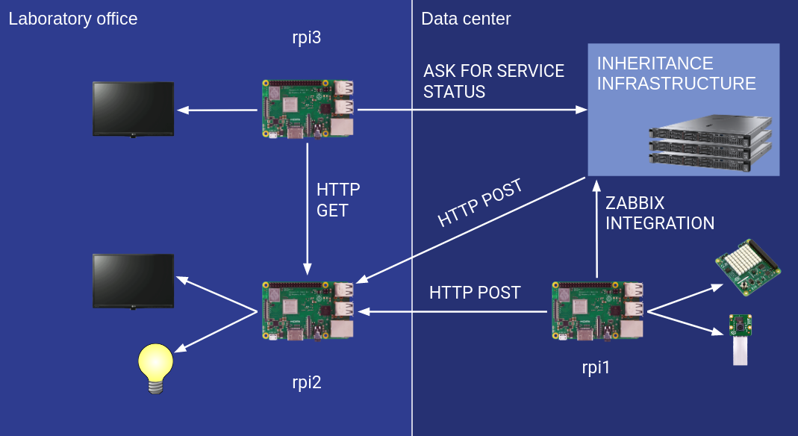

My Bachelor's Degree Thesis consists of a system to monitor the status of the service of the laboratory of the Computer Engineering Department at my university (Universidad Carlos III de Madrid), with the aim to simplify the daily work at the laboratory.

The origin of this system responds to **a need I identified when I started to work at** the Computer Science Department at my university. I saw some tasks and things that could be improved, then **I got and idea and I shared it** with my superiors. They liked it so much that they encourage me to make it a reality

My thesis report is written in Spanish under the title "Sistema de monitorización y alertas de estado para el laboratorio del Departamento de Informática". However, it contains a ten pages summary in English. The report can be found at [my university digital archive](https://e-archivo.uc3m.es) (login required) or you can download it directly [from here](https://aalonso.eu/documents/TFG_Aitor_Alonso_Nuñez.pdf).

The repository at GitHub with the source code can be found [here](https://github.com/tairosonloa/bachelor_degree_thesis).

## About the system
### What does the system do?
The laboratory of the Computer Engineering Department is in charge of maintain a data center with some servers and some computer classrooms. This system was defined to accomplish the following list of goals:

* **To monitor the data center** and server status: temperature, humidity, room light (switched on/off) and power supply.
* **To monitor the classrooms status** and the status of their computers: classroom reservations, classroom occupation, computer occupation, and computer status.
* To present all the system information in a way that should be **understandable and comprehensible at a glance.**
* **To alert the laboratory staff** of every unusual or strange situation and failures on the data center or the classrooms as soon as possible.

### System architecture
The system architecture is composed of the following elements:

* Three Raspberry Pi 3 model B+ computers.
* A SenseHat Raspberry Pi sensors module.
* A camera Raspberry Pi module.
* Two computer monitors (on the laboratory office walls).
* A Wi-Fi Philips &reg; Hue &trade; White and Color Ambiance light bulb.

Figure 1: system architecture diagram.

The first raspberry (rpi1) is inside the data center and it's monitoring the room with the SenseHat and camera modules. It sends the information it gets to the inheritance infrastructure (an old Zabbix instance) and to the second raspberry (rpi2, which is in the laboratory office).

Rpi2 gets the data center monitoring data from rpi1 from an authenticated HTTP POST request to an API REST that is running on it (called rpi2_api). Rpi2 is connected to one monitor and the Wi-Fi light bulb. The monitor shows a Grafana instance that gets the data from Zabbix and prints the data center status in a kiosk mode. Rpi2_api controls the alerts and alarms the laboratory staff if there is something that they should attend to. When an alarm is fired, a siren sound plays on the monitor speakers and the Wi-Fi light bulb blinks on red.

Rpi3 has a custom light server written in Go, another API REST (called rpi3_api), and a web dashboard made with GatsbyJS (a framework for React). The web dashboard is shown on the monitor and it prints the classroom reservations for today, the classrooms occupation and the computers' status. All this information is retrieved from its own API REST, which abstracts and centralizes the inheritance infrastructure. The API gets the classroom reservations with a web crawler from the laboratory website (it was a requirement to not connect to the database for that), and the computers status and occupation from a remote command execution via SSH.

## System impact
With this project **I got graduated with honors**, and it supposed a huge improvement to the daily work at the of the laboratory of the Computer Engineering Department. The system is nowadays in productions and it helps the laboratory staff on the most routinely task, saving time for the most important ones. Also, it has allowed to discover some strange situations that were unknown before the system implementation, such that the university heating system is interfering with the cooling system at the Department data center, even when it is supposed to be isolated. This problem was investigated and fixed after the system implementation.

I have had the possibility to see the before and after, and also to keep the system growing and improving to supply the laboratory crew needs and to enhance their work. Furthermore, after its implementation, it is easier to prevent hardware/software failures and to schedule maintenance tasks, which has meant a better quality of the services provided to researchers, teachers and students.

For all the explained above, I'm very proud of this project. A project that from its inception to its implantation was entirely my work.